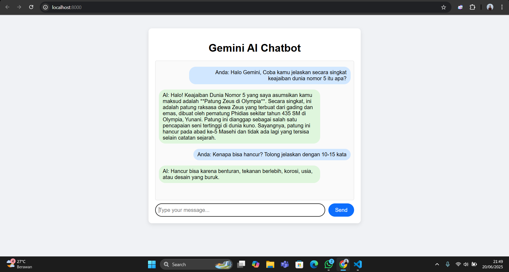

# 🤖 Google Chat Bot dengan Gemini API
Proyek ini adalah implementasi chatbot interaktif menggunakan **Gemini API** dari Google melalui integrasi Node.js + Express sebagai backend, serta HTML/CSS/JavaScript untuk tampilan frontend. Chatbot ini dapat menjawab berbagai pertanyaan secara real-time menggunakan model bahasa cerdas dari Google.

---

## 🚀 Fitur Utama
- Chatbot berbasis web yang dapat merespons pesan pengguna.
- Terintegrasi dengan **Google Gemini API**.
- Antarmuka responsif dan sederhana.
- Berbasis Express.js (Node.js) dan API POST.


## 🧠 Teknologi yang Digunakan
- [Node.js](https://nodejs.org/)
- [Express.js](https://expressjs.com/)
- [Google GenAI SDK (Gemini)](https://ai.google.dev/)
- HTML, CSS, JavaScript

## 🗂️ Struktur Folder
project-folder/
├── index.js # Server utama (Node.js + Express)
├── .env # Berisi API Key Gemini
├── package.json
├── public/
│ ├── index.html # Tampilan UI chatbot
│ ├── style.css # (Opsional) Styling chatbot
│ └── script.js # Logic interaksi frontend dengan API
└── README.md

## 🔐 Cara Mendapatkan API Key Gemini
1. Kunjungi [https://makersuite.google.com/app/apikey](https://makersuite.google.com/app/apikey).
2. Login dengan akun Google.
3. Klik **"Create API Key"**.
4. Salin API key yang diberikan.
5. Buat file `.env` di root folder dan tambahkan:

```env
GEMINI_API_KEY=YOUR_API_KEY_HERE
```

## 🛠️ Langkah Instalasi dan Menjalankan Proyek
1. Clone Repository
   ```env
   git clone https://github.com/username/google-chat-bot.git
   cd google-chat-bot
   ```
3. Install Dependencies
   ```env
   npm install express cors dotenv @google/genai
   ```
5. Buat File .env
   ```env
   GEMINI_API_KEY=YOUR_API_KEY_HERE
   ```
7. Jalankan Server
   ```env
   node index.js
   ```
9. Akses dari Browser
   Buka http://localhost:8000 di browser.

## 📮 Tampilan Chatbot

